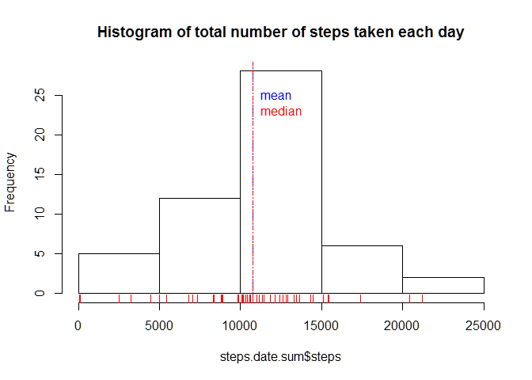
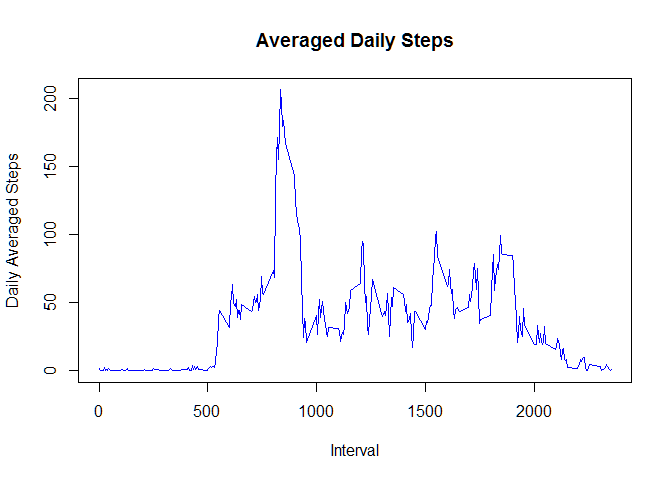
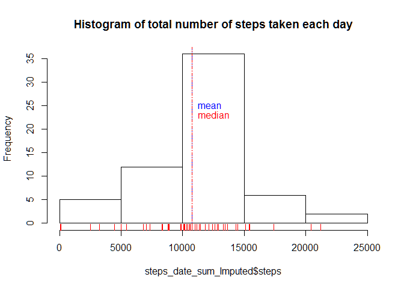
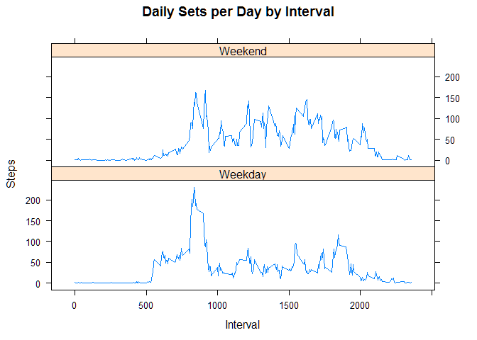

# Reproducible Research: Peer Assessment 1


## Loading and preprocessing the data


```r
data <- read.csv(unz("activity.zip", "activity.csv"), header=TRUE ,sep=",")
```
Inspecting the data

```r
head(data)
```

```
##   steps       date interval
## 1    NA 2012-10-01        0
## 2    NA 2012-10-01        5
## 3    NA 2012-10-01       10
## 4    NA 2012-10-01       15
## 5    NA 2012-10-01       20
## 6    NA 2012-10-01       25
```
Removing Missing Data - NA rows

```r
data.omitted.na <- na.omit(data) 
head(data.omitted.na)
```

```
##     steps       date interval
## 289     0 2012-10-02        0
## 290     0 2012-10-02        5
## 291     0 2012-10-02       10
## 292     0 2012-10-02       15
## 293     0 2012-10-02       20
## 294     0 2012-10-02       25
```
Sum up the Steps aggregated per Day 

```r
steps.date.sum <- aggregate(data.omitted.na$steps ~ data.omitted.na$date, data.omitted.na, FUN=sum )
colnames(steps.date.sum) <- c("dates","steps")
```
Inspect the data set

```r
head(steps.date.sum)
```

```
##        dates steps
## 1 2012-10-02   126
## 2 2012-10-03 11352
## 3 2012-10-04 12116
## 4 2012-10-05 13294
## 5 2012-10-06 15420
## 6 2012-10-07 11015
```

## What is mean total number of steps taken per day?


#### 1.Make a histogram of the total number of steps taken each day


```r
hist(x = steps.date.sum$steps, main = "Histogram of total number of steps taken each day")
abline(v=mean(steps.date.sum$steps), lty=3, col="blue")                   # draw a blue line thru the mean  
abline(v=median(steps.date.sum$steps), lty=4, col="red")                  # draw a red line thru the median  
text(mean(steps.date.sum$steps),25,labels="mean", pos=4, col="blue")      # label the mean  
text(mean(steps.date.sum$steps),23,labels="median", pos=4, col="red")
rug(steps.date.sum$steps, col="red") 
```

 

#### 2.Calculate and report the mean and median total number of steps taken per day


```r
summary(steps.date.sum$steps)
```

```
##    Min. 1st Qu.  Median    Mean 3rd Qu.    Max. 
##      41    8841   10760   10770   13290   21190
```

## What is the average daily activity pattern?

1.Make a time series plot (i.e. type = "l") of the 5-minute interval (x-axis) and the average number of steps taken, averaged across all days (y-axis)

  * Load Time Series library
  
  * Subset Dataset to Interval and Steps
  
  * simplify column names
  


```r
library("forecast")
```

```
## Loading required package: zoo
## 
## Attaching package: 'zoo'
## 
## The following objects are masked from 'package:base':
## 
##     as.Date, as.Date.numeric
## 
## Loading required package: timeDate
```

```
## Warning: package 'timeDate' was built under R version 3.1.2
```

```
## This is forecast 5.6
```

```r
intervals.steps <- data.frame(cbind(data.omitted.na$interval, data.omitted.na$steps))
colnames(intervals.steps) <- c("interval", "steps")
```

* calculate averaged daily steps 


```r
intervals.meanSteps <- aggregate(intervals.steps$steps ~ intervals.steps$interval,data = intervals.steps, FUN=mean )
colnames(intervals.meanSteps) <- c("interval", "MeanSteps")
```


```r
myts <- ts(data = intervals.meanSteps)
```

plot time series: average daily steps and plotted from available interval data (NA rows were removed)


```r
plot(MeanSteps ~ interval, 
     data = myts, 
     type = "l", 
     col = "blue",
     xlab="Interval", 
     ylab="Daily Averaged Steps", 
     main = "Averaged Daily Steps"
     )
```

 

2.Which 5-minute interval, on average across all the days in the dataset, contains the maximum number of steps?

```r
MaxMeanStepInterval <- intervals.meanSteps$interval[which.max(intervals.meanSteps$MeanSteps)]
MaxMeanStep <- intervals.meanSteps$MeanSteps[which.max(intervals.meanSteps$MeanSteps)]
```
##### Interval 835 contains the Max Mean Step value of 206.1698113 

## Imputing missing values

Note that there are a number of days/intervals where there are missing values (coded as NA). The presence of missing days may introduce bias into some calculations or summaries of the data.

1.Calculate and report the total number of missing values in the dataset (i.e. the total number of rows with NAs)

```r
count.na <- sum(!complete.cases(data))
```
##### The are 2304 rows that have value of NA

2.Devise a strategy for filling in all of the missing values in the dataset. The strategy does not need to be sophisticated. For example, you could use the mean/median f
or that day, or the mean for that 5-minute interval, etc.

I used mean for 5-minute intervals

Create two data sets - one without NA values and one with NA values to impute values into.

```r
# data <- read.csv(unz("activity.zip", "activity.csv"), header=TRUE ,sep=",")
nadata <-data[is.na(data[]),]
non_nadata <- na.omit(data)
```
assign interval mean step values per rows with NA values 

```r
nadata$steps <-sapply(nadata$interval, function(x) intervals.meanSteps[intervals.meanSteps$interval== x, 2])
```

3.Create a new dataset that is equal to the original dataset but with the missing data filled in.
re-Combine two data sets into one called Imputed_Data


```r
Imputed_Data <-rbind(non_nadata,nadata)
```


4.Make a histogram of the total number of steps taken each day and Calculate and report the mean and median total number of steps taken per day. Do these values differ from the estimates from the first part of the assignment? What is the impact of imputing missing data on the estimates of the total daily number of steps?

Sum up the Steps aggregated per Day 

```r
steps_date_sum_Imputed <- aggregate(Imputed_Data$steps ~ Imputed_Data$date, Imputed_Data, FUN=sum )
colnames(steps_date_sum_Imputed) <- c("dates","steps")


hist(x = steps_date_sum_Imputed$steps, main = "Histogram of total number of steps taken each day")
abline(v=mean(steps.date.sum$steps), lty=3, col="blue")                   # draw a blue line thru the mean  
abline(v=median(steps.date.sum$steps), lty=4, col="red")                  # draw a red line thru the median  
text(mean(steps.date.sum$steps),25,labels="mean", pos=4, col="blue")      # label the mean  
text(mean(steps.date.sum$steps),23,labels="median", pos=4, col="red")
rug(steps.date.sum$steps, col="red") 
```

 

####Both the Mean and Median have the same value of 10770 as evidenced in the summary.

```r
summary(steps_date_sum_Imputed$steps)
```

```
##    Min. 1st Qu.  Median    Mean 3rd Qu.    Max. 
##      41    9819   10770   10770   12810   21190
```

## Are there differences in activity patterns between weekdays and weekends?
For this part the weekdays() function may be of some help here. Use the dataset with the filled-in missing values for this part.

1.Create a new factor variable in the dataset with two levels – “weekday” and “weekend” indicating whether a given date is a weekday or weekend day.


```r
weekdays <- c("Monday", "Tuesday", "Wednesday", "Thursday", "Friday")
Imputed_Data$WeekDayName = as.factor(ifelse(is.element(weekdays(as.Date(Imputed_Data$date)),weekdays), "Weekday", "Weekend"))
Interval_Steps <- aggregate(steps ~ interval + Imputed_Data$WeekDayName, Imputed_Data, mean)
colnames(Interval_Steps) <- c( "interval", "WeekDayName", "steps")
```

2.Make a panel plot containing a time series plot (i.e. type = "l") of the 5-minute interval (x-axis) and the average number of steps taken, averaged across all weekday days or weekend days (y-axis). See the README file in the GitHub repository to see an example of what this plot should look like using simulated data..


```r
library(lattice)
```

```
## Warning: package 'lattice' was built under R version 3.1.2
```

```r
xyplot(Interval_Steps$steps ~ Interval_Steps$interval|Interval_Steps$WeekDayName, main="Daily Sets per Day by Interval",xlab="Interval", ylab="Steps",layout=c(1,2), type="l")
```

 
